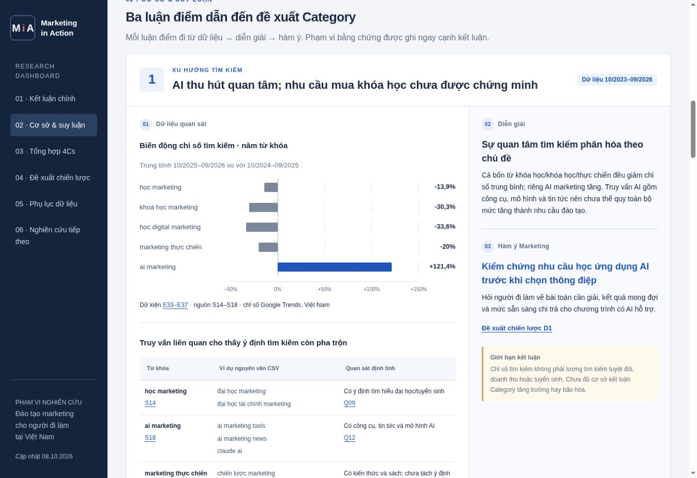

# Dashboard QA · 08 October 2026

Layout revision: `7fdadef5ea18f2c8ae55c0461284d329c6b0c1e4`.

## Reading and evidence flow

- Executive Category conclusion, five case questions, three evidence/reasoning chains, four Cs, three proposed decisions, data appendix, research gaps.
- Each argument separates observed data, interpretation, marketing implication, and limits.
- D1–D3 link back to their supporting arguments and state conditions for a decision.
- Four Cs render side by side on desktop. Pending research remains explicitly pending.
- Appendix disclosures are collapsed on first load. Source and fact links automatically open their containing disclosures.

## Data integrity and interaction checks

- Research data unchanged: 37 quantitative facts, 13 qualitative observations, 18 sources; 24 original CSV files retained.
- Five individual Trends changes recalculated from the original monthly series: 36 analysis months, three complete 12-month windows. Values match the stored evidence.
- Unique HTML IDs; all local file and hash references resolve; all static JavaScript containers exist; JavaScript syntax check passed.
- Chart → E33 → S14 and query example → Q12 → S18 opened the correct evidence and source.
- A filtered-out fact link restores the evidence table and opens the fact.
- Search empty state tested. Source S18 returns 1/37 facts; learning-source group returns 5/37 facts.
- Individual Trends selector renders five options; AI marketing shows 60 regional rows, 50 Top rows, 50 Rising rows and four original CSV links.

## Responsive checks

Tested the live dashboard in same-origin frames at 390, 768 and 1366 px using `responsive.html`.

- No document-wide horizontal overflow at any tested width. Wide raw-data tables scroll within their own containers.
- Desktop: evidence and reasoning sit beside each other; four Cs form four columns.
- Tablet: navigation sits above content; four Cs form two columns.
- Mobile: evidence precedes interpretation and implication; four Cs form one column.
- Fixed overlapping chart ticks. Final visible mobile tick labels (−50%, 0%, +150%) have non-overlapping bounding boxes; all five bars render.
- Fixed tablet header wrapping and versioned assets to avoid stale layout files.

## Content limits retained

- Search-interest changes are not search volumes, sales growth or enrollment growth.
- Vietnam 2023–24 and SEA 2026 surveys are kept separate; 57% and 78% are not used as a growth series.
- Supplier descriptions establish advertised offers, not actual learner composition or delivery quality.
- AI interest and skills gaps do not establish willingness to pay. Missing keyword data is not treated as zero demand.

